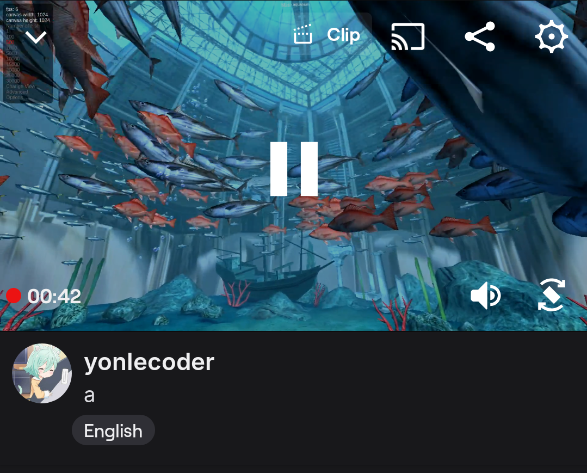

# kotak pajangan



a magical box that opens browser and screams its pixels at rtmp streams. perfect for when you need to violently share cat videos at 2am.

**what it do**:
- yeet web content into rtmp streams (like twitch/youtube)
- autoplay what's on the web content (with sound)
- make your cpu cry in 4k software rendering

⚠️ **warning le cpu**:
- no graphics go brr (DRI-less)
- your processor will sound like jet engine
- everything rendered in slow-mo software (rip frames)

## requirement
minimum:
- ram: 4 GB
- cpu: 4 cores

recommended:
- ram: **8 GB**
- cpu: **8 cores**

## make it go brrr

u need [docker](https://docker.com) or [podman](https://podman.io). choose your weapon.

### build it (if u fancy)
```bash
# docker style
docker build -f Containerfile -t kotak .

# podman style
podman build -f Containerfile -t kotak .
```

### or steal prebuilt (lazy gang)
```bash
docker pull ghcr.io/yonle/kotak_pajangan:master
# or
podman pull ghcr.io/yonle/kotak_pajangan:master
```

### make le container
replace secrets:
- `STREAM`: your rtmp sink (like `rtmps://live.twitch.tv/app/ur_key`)
- `WEB`: thing to stream (try `https://pointerpointer.com` for funsies)

```bash
# docker magic
docker create --name pajangan \
  --cpus=4 -m 4g \
  -e "STREAM=rtmps://live.example.com/ur_key" \
  -e "WEB=https://webglsamples.org/aquarium/aquarium.html" \
  kotak  # or ghcr.io/yonle/kotak_pajangan:master if stolen

# podman wizardry
podman create --name pajangan \
  --cpus=4 -m 4g \
  -e "STREAM=rtmps://live.example.com/ur_key" \
  -e "WEB=https://webglsamples.org/aquarium/aquarium.html" \
  ghcr.io/yonle/kotak_pajangan:master
```

or if you wanna touchy:
```
# docker magic
docker create --name pajangan \
  --cpus=4 -m 4g \
  -e "STREAM=rtmps://live.example.com/ur_key" \
  -e "WEB=https://webglsamples.org/aquarium/aquarium.html" \
  -e "VNC=1" \
  -p 5900:5900 \
  kotak  # or ghcr.io/yonle/kotak_pajangan:master if stolen

# podman wizardry
podman create --name pajangan \
  --cpus=4 -m 4g \
  -e "STREAM=rtmps://live.example.com/ur_key" \
  -e "WEB=https://webglsamples.org/aquarium/aquarium.html" \
  -e "VNC=1" \
  -p 5900:5900 \
  ghcr.io/yonle/kotak_pajangan:master
```

### FIRE IN THE HOLE
```bash
docker start pajangan  # or
podman start pajangan
```

**note**: if you enabled vnc before, you could connect now to localhost:5900 with your vnc viewer

now watch cpu temp go 📈 while browser screams at rtmp. perfect.

> pro tip: if stream no work, check if:
> - url actually load (test in real browser)
> - rtmp key not expired
> - your cpu not actually on fire 🔥

---

made when bored at 3am. may contain traces of sleep deprivation.
stream responsibly (or don't, idc).
